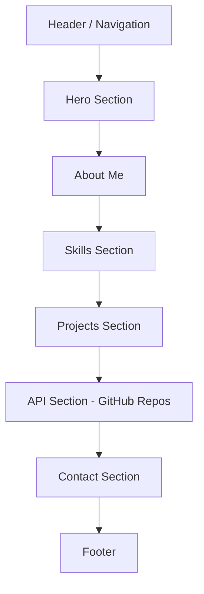
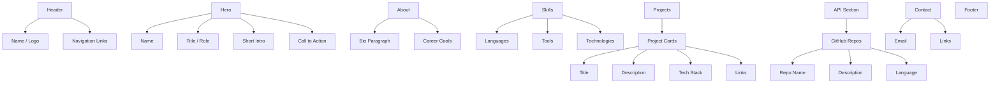
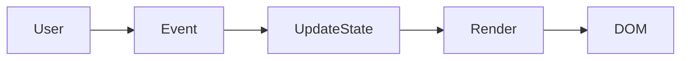

# **PROG2700 — Mini-Project 3 (MP3) / Final Assignment**

# **Professional Developer Portfolio (GitHub Pages + Tailwind CSS v4)**

---

# **1. Assignment Details**

| Field                    | Information                                          |
| ------------------------ | ---------------------------------------------------- |
| **Course**               | PROG2700                                             |
| **Mini-Project / Final** | MP3 — Professional Developer Portfolio               |
| **Type**                 | Individual                                           |
| **Weight**               | (Instructor defined — recommended highest weighting) |
| **Estimated Effort**     | 15–20 hours                                          |
| **Delivery Mode**        | In-class + asynchronous                              |
| **Due**                  | (Instructor will specify)                            |

---

# **2. Overview / Purpose / Objectives**

## Overview

You will design and develop a **professional developer portfolio** as a **client-side web application** using:

* **Vanilla JavaScript (no frameworks)**
* **DOM manipulation**
* **Tailwind CSS v4**
* **GitHub Pages deployment**

This portfolio must be **data-driven and interactive**, not a static website.

---

## Purpose

This project represents:

> Your **first professional developer portfolio**

It must demonstrate your ability to:

* build a client-side application
* integrate real data
* create a modern user experience
* publish your work publicly

---

## Objectives

You will:

* Apply JavaScript programming to a real-world application
* Build dynamic UI using DOM manipulation
* Integrate API data into your portfolio
* Use Tailwind CSS v4 for layout and design
* Deploy a live application using GitHub Pages
* Document your project using professional GitHub standards

---

# **3. Learning Outcomes Addressed (Mandatory Alignment)**

Your portfolio must **explicitly demonstrate** the following outcomes through its **data and functionality**.

## Outcome 1 — JavaScript Proficiency

Your portfolio must:

* use structured JavaScript (functions, arrays, objects)
* store and manage data in JavaScript, not hardcoded HTML
* implement application logic

### Required Implementation

```javascript
const projects = [ ... ];
const skills = [ ... ];
```

---

## Outcome 2 — DOM Manipulation

Your portfolio must:

* dynamically render content such as projects, skills, and sections
* update UI based on user interaction
* use event listeners such as click and input

---

## Outcome 3 — API Integration

Your portfolio must integrate **at least one public API**.

### Recommended

* **GitHub API** to display your repositories

Example:

```javascript
https://api.github.com/users/YOUR_USERNAME/repos
```

You must:

* fetch data
* parse JSON
* render results
* handle errors

---

## Outcome 4 — Professional Workflow / Documentation

Your portfolio must:

* be stored in a public GitHub repository using the required naming convention
* be deployed as a working GitHub Pages site
* include the required professional documentation (`README.md`, `docs/architecture.md`, `docs/reflection.md`)

---

## Outcome 5 — Tailwind CSS / UI / UX

Your portfolio must:

* use Tailwind CSS v4
* be responsive across mobile and desktop
* follow modern UI practices
* provide a clean and readable interface

---

# **4. Assignment Description / Use Case**

## The Application

You will build a **Developer Portfolio Application** that presents:

* who you are
* what you’ve built
* what you can do

## Required Sections

Your portfolio must include:

* **Hero / Introduction**
* **About Me**
* **Skills**
* **Projects**
* **API Section**
* **Contact**
* **Footer**

## Critical Requirement

Your portfolio must behave like an **application**.

* Static HTML only is **not acceptable**
* JavaScript-driven rendering is **required**

---

# **5. Visual Layout Guidance**

Use the following diagrams to guide your layout and structure.

## 5.1 High-Level Site Flow

This shows the main page flow from top to bottom.



## 5.2 Detailed Section Breakdown

This shows what belongs inside each section.



## 5.3 Visual Design Note

Think of your portfolio as a professional story:

1. **Who am I?** → Hero
2. **What should people know about me?** → About
3. **What can I do?** → Skills
4. **What have I built?** → Projects
5. **What live data can prove it?** → API Section
6. **How can I be reached?** → Contact

---

# **6. Tasks / Instructions**

# **Part A — Create GitHub Repository**

Create a new repository named:

```bash
wXXXXXXX-PROG2700-MP3
```

Replace `XXXXXXX` with your student ID.

Set the repository to **public**.

Create it as an **empty repository** so Vite can scaffold directly into the project root.
Do **not** initialize it with a README, `.gitignore`, or license before running the setup steps below.

## Public Repository Notice

Your work will be publicly accessible.

You must **not** include:

* API keys
* passwords
* private data
* sensitive personal information

You are responsible for ensuring that the portfolio is safe to publish publicly.

---

# **Part B — Project Setup (VS Code + Vite)**

## Step 1 — Clone your repository

```bash
git clone https://github.com/your-username/wXXXXXXX-PROG2700-MP3.git
cd wXXXXXXX-PROG2700-MP3
code .
```

## Step 2 — Create the app

```bash
npm create vite@latest . -- --template vanilla
npm install
```

This scaffold command expects the repository root to be empty.
If you already added starter files such as `README.md` or `LICENSE`, remove them first or scaffold Vite in a temporary folder and move the generated app files into your repository before continuing.

## Step 3 — Run development server

```bash
npm run dev
```

---

# **Part C — Install Tailwind CSS v4**

## Step 4 — Install Tailwind v4

```bash
npm install tailwindcss @tailwindcss/postcss postcss
```

## Step 5 — Configure PostCSS

Create or update `postcss.config.js`:

```javascript
export default {
  plugins: {
    "@tailwindcss/postcss": {},
  },
};
```

## Step 6 — Add Tailwind to CSS

In `src/style.css`:

```css
@import "tailwindcss";
```

## Step 7 — Import CSS

In `src/main.js`:

```javascript
import "./style.css";
```

## Step 8 — Verify Tailwind works

Add a quick test:

```html
<h1 class="text-3xl font-bold text-blue-600">Portfolio</h1>
```

### Memory Jog

If styles do not appear:

* check the CSS import
* restart the dev server
* confirm file names and paths

---

# **Part D — Build the Portfolio Structure**

## Step 9 — Create the layout

Build:

* header / navigation
* main sections
* footer

## Step 10 — Create section containers

Create containers for:

* Hero
* About
* Skills
* Projects
* API section
* Contact

## Step 11 — Apply Tailwind layout

Use Tailwind for:

* spacing
* typography
* layout
* responsive behavior
* visual hierarchy

---

# **Part E — Data-Driven Portfolio (Mandatory)**

## Step 12 — Define your data in JavaScript

```javascript
const projects = [
  {
    title: "API Explorer",
    description: "Displays public API data",
    tech: ["JavaScript", "Tailwind"]
  }
];
```

## Step 13 — Render projects dynamically

You must:

* loop through data
* create DOM elements
* inject those elements into the page

## Step 14 — Render skills dynamically

Store skills in an array and render them using JavaScript.

This is how your portfolio proves **Outcome 1** and **Outcome 2**.

---

# **Part F — Interactivity (Required)**

## Step 15 — Implement at least two features

Choose from:

* project filtering
* project search
* modal view
* dark/light mode
* expand/collapse sections

## Step 16 — Use event listeners

Example:

```javascript
button.addEventListener("click", () => {
  // update UI
});
```

---

# **Part G — API Integration (Required)**

## Step 17 — Fetch API data

Example using GitHub:

```javascript
async function getRepos(username) {
  const res = await fetch(`https://api.github.com/users/${username}/repos`);
  if (!res.ok) throw new Error("API error");
  return await res.json();
}
```

## Step 18 — Render API data

Display useful fields such as:

* repository name
* description
* language
* link

## Step 19 — Handle UI states

Your UI must show:

* loading
* empty
* error, including network issues or GitHub API rate limits

---

# **Part H — GitHub Pages Deployment**

## Step 20 — Configure Vite base path

In `vite.config.js`:

```javascript
import { defineConfig } from "vite";

export default defineConfig({
  base: "/wXXXXXXX-PROG2700-MP3/",
});
```

## Step 21 — Add deployment scripts

Install gh-pages:

```bash
npm install --save-dev gh-pages
```

In `package.json`:

```json
{
  "homepage": "https://your-username.github.io/wXXXXXXX-PROG2700-MP3",
  "scripts": {
    "dev": "vite",
    "build": "vite build",
    "predeploy": "npm run build",
    "deploy": "gh-pages -d dist"
  }
}
```

## Step 22 — Deploy

```bash
npm run deploy
```

## Step 23 — Enable GitHub Pages

In GitHub:

* go to **Settings**
* open **Pages**
* set the deployment source to the `gh-pages` branch created by `npm run deploy`
* select the root (`/`) folder if GitHub asks for a folder
* wait for the site URL to appear before testing the live deployment

## Step 24 — Test the live site

Verify:

* styles load
* JavaScript works
* API content loads
* links work

---

# **7. Deliverables**

Students must submit:

## 1. GitHub Repository

* named correctly
* public
* contains the full project

## 2. GitHub Pages URL

This is the **primary submission**.

Example:

```text
https://username.github.io/wXXXXXXX-PROG2700-MP3
```

---

# **8. Required Documentation**

Your repository must include:

```text
README.md
docs/architecture.md
docs/reflection.md
```

## README must include

* project description
* features
* API used
* setup steps
* GitHub Pages link
* screenshots

## Architecture document must include

* file structure
* data flow
* rendering approach

## Reflection document must answer

1. How did you structure your JavaScript?
2. How does your portfolio demonstrate the course outcomes?
3. What challenges did you face?
4. What would you improve?

---

# **9. Assessment & Rubric**

| Category         | Criteria                             | Weight |
| ---------------- | ------------------------------------ | ------ |
| JavaScript       | Logic, structure, data-driven design | 30%    |
| DOM Manipulation | Dynamic rendering, interactivity     | 25%    |
| API Integration  | Data retrieval and display           | 15%    |
| Tailwind UI      | Design, responsiveness, readability  | 20%    |
| Documentation    | Clarity and completeness             | 10%    |

---

# **10. Submission Guidelines**

Submit:

* GitHub repository link
* GitHub Pages URL

Ensure:

* repo is public
* naming is correct
* live site works

---

# **11. Starter HTML + Tailwind Layout Scaffold**

This scaffold matches the required layout diagrams and gives students a clean starting structure. It is intentionally simple so students can build the dynamic behavior themselves.

## `index.html`

```html
<!DOCTYPE html>
<html lang="en" class="scroll-smooth">
<head>
  <meta charset="UTF-8" />
  <meta name="viewport" content="width=device-width, initial-scale=1.0" />
  <title>Developer Portfolio</title>
</head>
<body class="bg-slate-950 text-slate-100 antialiased">
  <!-- Header / Navigation -->
  <header class="sticky top-0 z-50 border-b border-white/10 bg-slate-950/90 backdrop-blur">
    <div class="mx-auto flex max-w-6xl items-center justify-between px-4 py-4">
      <a href="#hero" class="text-lg font-bold tracking-wide">Your Name</a>

      <nav aria-label="Primary navigation">
        <ul class="flex flex-wrap items-center gap-4 text-sm">
          <li><a class="transition hover:text-cyan-300" href="#about">About</a></li>
          <li><a class="transition hover:text-cyan-300" href="#skills">Skills</a></li>
          <li><a class="transition hover:text-cyan-300" href="#projects">Projects</a></li>
          <li><a class="transition hover:text-cyan-300" href="#github">GitHub</a></li>
          <li><a class="transition hover:text-cyan-300" href="#contact">Contact</a></li>
        </ul>
      </nav>
    </div>
  </header>

  <main>
    <!-- Hero Section -->
    <section id="hero" class="border-b border-white/10">
      <div class="mx-auto grid min-h-[70vh] max-w-6xl items-center gap-10 px-4 py-20 md:grid-cols-2">
        <div class="space-y-6">
          <p class="text-sm font-semibold uppercase tracking-[0.2em] text-cyan-300">PROG2700 Portfolio</p>
          <h1 class="text-4xl font-black tracking-tight md:text-6xl">
            Hi, I’m <span class="text-cyan-300">Your Name</span>
          </h1>
          <p class="max-w-xl text-lg leading-8 text-slate-300">
            I build client-side web applications using JavaScript, APIs, and modern CSS workflows.
          </p>
          <div class="flex flex-wrap gap-3">
            <a href="#projects" class="rounded-xl bg-cyan-400 px-5 py-3 font-semibold text-slate-950 transition hover:bg-cyan-300">
              View Projects
            </a>
            <a href="#contact" class="rounded-xl border border-white/15 px-5 py-3 font-semibold transition hover:border-cyan-300 hover:text-cyan-300">
              Contact Me
            </a>
          </div>
        </div>

        <div class="rounded-3xl border border-white/10 bg-white/5 p-6 shadow-2xl">
          <div class="aspect-[4/3] rounded-2xl border border-dashed border-white/15 bg-slate-900/70 grid place-items-center text-slate-400">
            Profile Image / Intro Graphic Placeholder
          </div>
        </div>
      </div>
    </section>

    <!-- About Section -->
    <section id="about" class="border-b border-white/10">
      <div class="mx-auto max-w-6xl px-4 py-20">
        <div class="mb-10 max-w-2xl">
          <p class="mb-3 text-sm font-semibold uppercase tracking-[0.2em] text-cyan-300">About Me</p>
          <h2 class="text-3xl font-bold md:text-4xl">Who I am and where I’m headed</h2>
        </div>

        <div class="grid gap-8 md:grid-cols-2">
          <article class="rounded-3xl border border-white/10 bg-white/5 p-6">
            <h3 class="mb-4 text-xl font-semibold">Bio</h3>
            <p class="leading-8 text-slate-300">
              Write a short professional biography here. Explain your interests, your program, and the type of work you want to do.
            </p>
          </article>

          <article class="rounded-3xl border border-white/10 bg-white/5 p-6">
            <h3 class="mb-4 text-xl font-semibold">Career Goals</h3>
            <p class="leading-8 text-slate-300">
              Describe the direction you want your career to take and the technical areas you want to continue developing.
            </p>
          </article>
        </div>
      </div>
    </section>

    <!-- Skills Section -->
    <section id="skills" class="border-b border-white/10">
      <div class="mx-auto max-w-6xl px-4 py-20">
        <div class="mb-10 max-w-2xl">
          <p class="mb-3 text-sm font-semibold uppercase tracking-[0.2em] text-cyan-300">Skills</p>
          <h2 class="text-3xl font-bold md:text-4xl">Languages, tools, and technologies</h2>
        </div>

        <div class="grid gap-6 md:grid-cols-3">
          <article class="rounded-3xl border border-white/10 bg-white/5 p-6">
            <h3 class="mb-4 text-xl font-semibold">Languages</h3>
            <div id="skills-languages" class="flex flex-wrap gap-2">
              <!-- Render language skill pills here -->
            </div>
          </article>

          <article class="rounded-3xl border border-white/10 bg-white/5 p-6">
            <h3 class="mb-4 text-xl font-semibold">Tools</h3>
            <div id="skills-tools" class="flex flex-wrap gap-2">
              <!-- Render tool skill pills here -->
            </div>
          </article>

          <article class="rounded-3xl border border-white/10 bg-white/5 p-6">
            <h3 class="mb-4 text-xl font-semibold">Technologies</h3>
            <div id="skills-technologies" class="flex flex-wrap gap-2">
              <!-- Render technology skill pills here -->
            </div>
          </article>
        </div>
      </div>
    </section>

    <!-- Projects Section -->
    <section id="projects" class="border-b border-white/10">
      <div class="mx-auto max-w-6xl px-4 py-20">
        <div class="mb-10 flex flex-col gap-6 md:flex-row md:items-end md:justify-between">
          <div class="max-w-2xl">
            <p class="mb-3 text-sm font-semibold uppercase tracking-[0.2em] text-cyan-300">Projects</p>
            <h2 class="text-3xl font-bold md:text-4xl">Featured work</h2>
          </div>

          <div class="flex flex-wrap gap-3">
            <input
              id="project-search"
              type="search"
              placeholder="Search projects..."
              class="rounded-xl border border-white/10 bg-slate-900 px-4 py-3 text-sm outline-none ring-0 placeholder:text-slate-500 focus:border-cyan-300"
            />
            <button id="filter-all" class="rounded-xl border border-white/10 px-4 py-3 text-sm font-medium transition hover:border-cyan-300 hover:text-cyan-300">
              All
            </button>
            <button id="filter-js" class="rounded-xl border border-white/10 px-4 py-3 text-sm font-medium transition hover:border-cyan-300 hover:text-cyan-300">
              JavaScript
            </button>
          </div>
        </div>

        <div id="projects-grid" class="grid gap-6 md:grid-cols-2 xl:grid-cols-3">
          <!-- Render project cards here -->
        </div>
      </div>
    </section>

    <!-- API Section -->
    <section id="github" class="border-b border-white/10">
      <div class="mx-auto max-w-6xl px-4 py-20">
        <div class="mb-10 max-w-2xl">
          <p class="mb-3 text-sm font-semibold uppercase tracking-[0.2em] text-cyan-300">GitHub API</p>
          <h2 class="text-3xl font-bold md:text-4xl">Live repository data</h2>
          <p class="mt-4 leading-8 text-slate-300">
            This section should display real data retrieved from the GitHub API.
          </p>
        </div>

        <div id="github-status" class="mb-6 rounded-2xl border border-white/10 bg-white/5 p-4 text-slate-300">
          Loading state / status message placeholder
        </div>

        <div id="github-grid" class="grid gap-6 md:grid-cols-2 xl:grid-cols-3">
          <!-- Render GitHub repo cards here -->
        </div>
      </div>
    </section>

    <!-- Contact Section -->
    <section id="contact" class="border-b border-white/10">
      <div class="mx-auto max-w-6xl px-4 py-20">
        <div class="mb-10 max-w-2xl">
          <p class="mb-3 text-sm font-semibold uppercase tracking-[0.2em] text-cyan-300">Contact</p>
          <h2 class="text-3xl font-bold md:text-4xl">Get in touch</h2>
        </div>

        <div class="grid gap-6 md:grid-cols-2">
          <article class="rounded-3xl border border-white/10 bg-white/5 p-6">
            <h3 class="mb-4 text-xl font-semibold">Contact Information</h3>
            <ul class="space-y-3 text-slate-300">
              <li>Email: your-email@example.com</li>
              <li>GitHub: github.com/your-username</li>
              <li>LinkedIn or other professional link</li>
            </ul>
          </article>

          <article class="rounded-3xl border border-white/10 bg-white/5 p-6">
            <h3 class="mb-4 text-xl font-semibold">Professional Note</h3>
            <p class="leading-8 text-slate-300">
              Keep your public contact details appropriate for a professional audience. Do not post private or sensitive information.
            </p>
          </article>
        </div>
      </div>
    </section>
  </main>

  <!-- Footer -->
  <footer class="py-8">
    <div class="mx-auto flex max-w-6xl flex-col gap-2 px-4 text-sm text-slate-400 md:flex-row md:items-center md:justify-between">
      <p>© 2026 Your Name. Built with JavaScript, Tailwind CSS v4, and GitHub Pages.</p>
      <p>PROG2700 MP3 / Final Portfolio</p>
    </div>
  </footer>

  <script type="module" src="/src/main.js"></script>
</body>
</html>
```

## `src/main.js` starter scaffold

```javascript
import "./style.css";

const skills = {
  languages: ["JavaScript", "HTML", "CSS"],
  tools: ["VS Code", "Git", "GitHub"],
  technologies: ["Tailwind CSS", "APIs", "GitHub Pages"],
};

const projects = [
  {
    title: "API Explorer",
    description: "A client-side application that retrieves and displays public API data.",
    tech: ["JavaScript", "Tailwind", "API"],
    category: "JavaScript",
    url: "#",
  },
  {
    title: "Portfolio Website",
    description: "A professional portfolio built as a dynamic client-side application.",
    tech: ["JavaScript", "Tailwind", "GitHub Pages"],
    category: "JavaScript",
    url: "#",
  },
];

const state = {
  search: "",
  filter: "all",
  repos: [],
  githubStatus: "idle",
};

const GITHUB_USERNAME = "your-github-username";

function createSkillPill(text) {
  const span = document.createElement("span");
  span.className =
    "rounded-full border border-cyan-400/20 bg-cyan-400/10 px-3 py-1 text-sm text-cyan-200";
  span.textContent = text;
  return span;
}

function renderSkills() {
  const languageContainer = document.getElementById("skills-languages");
  const toolContainer = document.getElementById("skills-tools");
  const techContainer = document.getElementById("skills-technologies");

  languageContainer.innerHTML = "";
  toolContainer.innerHTML = "";
  techContainer.innerHTML = "";

  skills.languages.forEach((item) => languageContainer.appendChild(createSkillPill(item)));
  skills.tools.forEach((item) => toolContainer.appendChild(createSkillPill(item)));
  skills.technologies.forEach((item) => techContainer.appendChild(createSkillPill(item)));
}

function getFilteredProjects() {
  return projects.filter((project) => {
    const matchesFilter =
      state.filter === "all" || project.category.toLowerCase() === state.filter.toLowerCase();

    const searchText = `${project.title} ${project.description} ${project.tech.join(" ")}`.toLowerCase();
    const matchesSearch = searchText.includes(state.search.toLowerCase());

    return matchesFilter && matchesSearch;
  });
}

function renderProjects() {
  const grid = document.getElementById("projects-grid");
  grid.innerHTML = "";

  const filteredProjects = getFilteredProjects();

  if (filteredProjects.length === 0) {
    grid.innerHTML = `
      <div class="rounded-3xl border border-white/10 bg-white/5 p-6 text-slate-300">
        No projects matched your current search or filter.
      </div>
    `;
    return;
  }

  filteredProjects.forEach((project) => {
    const card = document.createElement("article");
    card.className = "rounded-3xl border border-white/10 bg-white/5 p-6";

    card.innerHTML = `
      <h3 class="mb-3 text-xl font-semibold">${project.title}</h3>
      <p class="mb-4 leading-7 text-slate-300">${project.description}</p>
      <div class="mb-5 flex flex-wrap gap-2">
        ${project.tech
          .map(
            (tech) =>
              `<span class="rounded-full border border-white/10 px-3 py-1 text-xs text-slate-300">${tech}</span>`
          )
          .join("")}
      </div>
      <a class="font-medium text-cyan-300 transition hover:text-cyan-200" href="${project.url}">
        View Project
      </a>
    `;

    grid.appendChild(card);
  });
}

function renderGitHubStatus(message) {
  const status = document.getElementById("github-status");
  status.textContent = message;
}

function createRepoCard(repo) {
  const card = document.createElement("article");
  card.className = "rounded-3xl border border-white/10 bg-white/5 p-6";

  const title = document.createElement("h3");
  title.className = "mb-3 text-xl font-semibold";
  title.textContent = repo.name;

  const description = document.createElement("p");
  description.className = "mb-4 leading-7 text-slate-300";
  description.textContent = repo.description ?? "No description provided.";

  const language = document.createElement("p");
  language.className = "mb-4 text-sm text-slate-400";
  language.textContent = `Language: ${repo.language ?? "Not specified"}`;

  const link = document.createElement("a");
  link.className = "font-medium text-cyan-300 transition hover:text-cyan-200";
  link.href = repo.html_url;
  link.target = "_blank";
  link.rel = "noopener noreferrer";
  link.textContent = "View Repository";

  card.append(title, description, language, link);
  return card;
}

function renderRepos() {
  const grid = document.getElementById("github-grid");
  grid.innerHTML = "";

  if (state.githubStatus === "loading") {
    renderGitHubStatus("Loading repositories...");
    return;
  }

  if (state.githubStatus === "error") {
    renderGitHubStatus("Could not load repositories. Please try again later.");
    return;
  }

  if (state.githubStatus === "success" && state.repos.length === 0) {
    renderGitHubStatus("No repositories were returned.");
    return;
  }

  if (state.githubStatus === "success") {
    renderGitHubStatus("Repositories loaded successfully.");
  }

  state.repos.forEach((repo) => {
    grid.appendChild(createRepoCard(repo));
  });
}

async function loadRepos(username) {
  try {
    state.githubStatus = "loading";
    renderRepos();

    const response = await fetch(`https://api.github.com/users/${username}/repos`);

    if (!response.ok) {
      throw new Error("Failed to fetch repositories");
    }

    const data = await response.json();

    state.repos = data.slice(0, 6);
    state.githubStatus = "success";
    renderRepos();
  } catch (error) {
    console.error(error);
    state.githubStatus = "error";
    renderRepos();
  }
}

function wireEvents() {
  const searchInput = document.getElementById("project-search");
  const filterAll = document.getElementById("filter-all");
  const filterJs = document.getElementById("filter-js");

  searchInput.addEventListener("input", (event) => {
    state.search = event.target.value;
    renderProjects();
  });

  filterAll.addEventListener("click", () => {
    state.filter = "all";
    renderProjects();
  });

  filterJs.addEventListener("click", () => {
    state.filter = "javascript";
    renderProjects();
  });
}

function init() {
  renderSkills();
  renderProjects();
  renderRepos();
  wireEvents();

  // Replace with your actual GitHub username.
  loadRepos(GITHUB_USERNAME);
}

init();
```

## `src/style.css`

```css
@import "tailwindcss";
```

---

# **12. Memory Jogger — Application Flow**



---

# **Final Note**

This project is:

* a technical assessment
* a demonstration of your client-side development skills
* a professional artifact you can continue improving beyond the course
